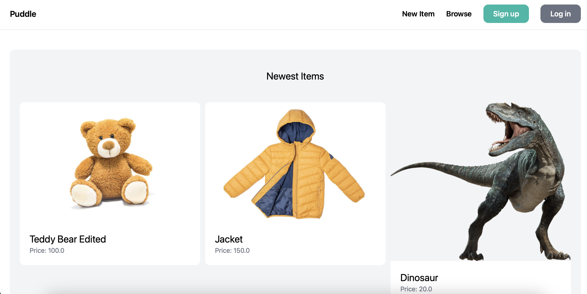

# Online Marketplace using Django

## Project Overview

This project includes essential features such as authentication, communication between users, and a comprehensive dashboard for managing items. 
You can add, search, edit, and delete (CRUD) items effortlessly. The project also incorporates form handling and many more exciting functionalities.

## Technologies Used

- **Django (Python):** The backend is powered by Django, a high-level Python web framework known for its simplicity and efficiency.

- **HTML:** The project utilizes HTML for structuring the web pages, ensuring a clean and user-friendly interface.

- **Tailwind CSS:** To enhance the visual appeal and responsiveness of our marketplace, I incorporated Tailwind CSS for styling.

## Screenshots



## Installation

1. **Create a virtual environment (Optional):**
    ```bash
    python -m venv venv
    source venv/bin/activate # venv/Scripts/activate on Windows
    ```

2. **Clone the repository:**
    ```bash
    git clone https://github.com/ardiaz8/puddle
    ```

3. **Navigate to the project:**
    ```bash
    cd puddle
    ```

4. **Install dependencies:**
    ```bash
    pip install -r requirements.txt
    ```

5. **Run the Django Development Server:**
    ```bash
    python manage.py runserver
    ```

The project will be accessible at [http://localhost:8000/](http://localhost:8000/).
